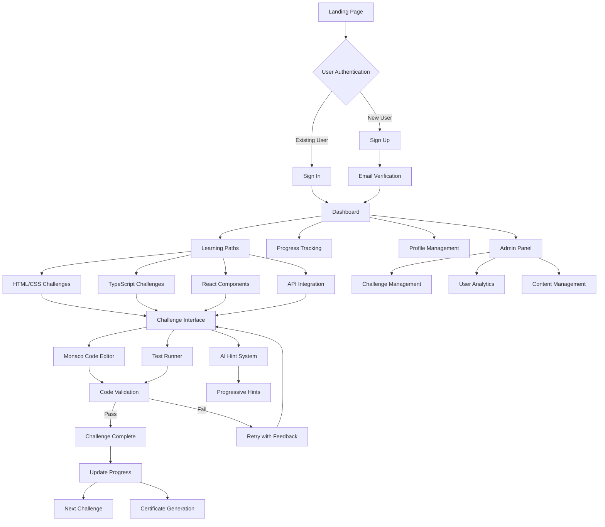

# Sense App - Architecture Flowchart & Content Strategy

## 🎯 App Overview
**Sense** is an Anti-Tutorial Hell SaaS Platform that forces users to solve real coding problems independently, building genuine developer confidence through challenge-based methodology.

## 🏗 Application Architecture Flowchart

## 🎥 Content Creation Strategy for Shorts & Blogs

### 📱 Short-Form Content (TikTok, Instagram Reels, YouTube Shorts)

#### **Phase 1: Anti-Tutorial Philosophy (Week 1-2)**
1. **"Why Tutorials are Killing Your Code Skills"** 
   - Hook: "You can follow 100 tutorials and still can't code"
   - Show: Split screen of tutorial follower vs problem solver

2. **"The Struggle is the Feature"**
   - Hook: "If you're not struggling, you're not learning"
   - Demo: Quick challenge attempt showing the thinking process

3. **"Tutorial Hell vs Real Learning"**
   - Hook: "This is how you escape tutorial hell"
   - Before/After: Dependent learner → Independent developer

#### **Phase 2: Platform Demo (Week 3-4)**
4. **"Challenge-Based Learning in Action"**
   - Hook: "No step-by-step. Just solve this."
   - Show: Challenge interface + thought process

5. **"AI Hints That Don't Spoil"**
   - Hook: "Hints that make you think, not copy"
   - Demo: Progressive hint system in action

6. **"Real-Time Progress Tracking"**
   - Hook: "Watch your confidence grow in real-time"
   - Show: Dashboard and progress visualization

#### **Phase 3: Success Stories & Tips (Week 5-6)**
7. **"From Tutorial Zombie to Problem Solver"**
   - Hook: "Here's how I broke free from tutorial dependency"
   - Story: Personal transformation narrative

8. **"How to Think Like a Developer"**
   - Hook: "This is how developers actually think"
   - Show: Problem decomposition process

9. **"The Art of Getting Unstuck"**
   - Hook: "Stuck? Here's what developers really do"
   - Tips: Research, documentation, experimentation

#### **Phase 4: Technical Deep Dives (Week 7-8)**
10. **"CSS That Actually Makes Sense"**
    - Hook: "Stop memorizing CSS, start understanding it"
    - Demo: Layout challenge breakdown

11. **"TypeScript for Real Projects"**
    - Hook: "TypeScript beyond basic types"
    - Show: Advanced type challenge

12. **"React Components That Scale"**
    - Hook: "Build components like a senior developer"
    - Demo: Component architecture challenge

### 📝 Blog Content Strategy

#### **Technical Deep Dives (Weekly)**
1. **"The Psychology of Programming: Why Tutorials Create Dependent Learners"**
   - Research-backed analysis
   - Cognitive load theory
   - Active vs passive learning

2. **"Building Developer Intuition: The Science Behind Challenge-Based Learning"**
   - Learning science principles
   - Problem-solving methodology
   - Confidence building through struggle

3. **"From Bootcamp to Job-Ready: Bridging the Skill Gap"**
   - Industry expectations vs tutorial skills
   - Real project requirements
   - Interview preparation

#### **Technical Tutorials (Bi-weekly)**
4. **"Advanced CSS Layout Patterns: Beyond Flexbox Basics"**
   - Grid + Flexbox combinations
   - Real-world layout challenges
   - Performance considerations

5. **"TypeScript Patterns for Scalable Applications"**
   - Advanced type patterns
   - Generic programming
   - API integration patterns

6. **"React Architecture for Growing Teams"**
   - Component composition
   - State management patterns
   - Testing strategies

#### **Platform Deep Dives (Monthly)**
7. **"Inside the Sense Challenge Engine"**
   - Technical architecture
   - Challenge creation process
   - AI hint system

8. **"Building Confidence Through Controlled Struggle"**
   - Pedagogical approach
   - Difficulty progression
   - Learning analytics

## 📅 Content Calendar Template

### Week 1-4: Foundation Building
- **Monday**: Technical blog post
- **Wednesday**: Short-form content (Instagram/TikTok)
- **Friday**: YouTube short + Twitter thread
- **Sunday**: Community engagement/Q&A

### Week 5-8: Advanced Content
- **Monday**: Deep-dive technical blog
- **Tuesday**: Platform feature showcase (short)
- **Thursday**: Developer story/case study
- **Saturday**: Weekend coding challenge

## 🎯 Content Themes by Quarter

### Q1: Foundation & Philosophy
- Anti-tutorial methodology
- Problem-solving mindset
- Developer confidence building
- Platform introduction

### Q2: Technical Excellence
- Advanced challenges showcase
- Real-world applications
- Industry best practices
- Career development

### Q3: Community & Growth
- User success stories
- Community challenges
- Peer learning
- Advanced features

### Q4: Mastery & Beyond
- Expert-level content
- Industry trends
- Career advancement
- Platform evolution

## 📊 Content Performance Metrics

### Short-Form Content KPIs
- **Engagement Rate**: Likes, comments, shares
- **Completion Rate**: Full video watch time
- **Click-Through Rate**: Profile visits → Platform signups
- **Conversion Rate**: Views → Trial users

### Blog Content KPIs
- **Time on Page**: Average reading time
- **Scroll Depth**: Content consumption depth
- **Social Shares**: Amplification metrics
- **Backlinks**: SEO and authority building

### Platform Integration KPIs
- **Trial Signups**: Content → Platform conversion
- **User Activation**: First challenge completion
- **Retention Rate**: Weekly active users
- **Upgrade Rate**: Free → Paid conversion

## 🚀 Content Automation & Tools

### Content Creation Tools
- **Video**: ScreenFlow/Camtasia for demos
- **Graphics**: Figma for social media assets
- **Scheduling**: Buffer/Hootsuite for posting
- **Analytics**: Google Analytics + social platform insights

### Content Repurposing Strategy
1. **Long-form blog** → Twitter thread → LinkedIn post
2. **Video demo** → GIF → Static infographic
3. **Challenge walkthrough** → Short clips → Story highlights
4. **User story** → Quote cards → Testimonial video

## 💡 Content Ideas Generator

### Daily Content Prompts
- "Today's coding challenge mindset:"
- "Real developer problem vs tutorial problem:"
- "What struggling with X actually teaches you:"
- "Industry expectation vs bootcamp reality:"

### Weekly Series Ideas
- **"Tutorial Hell Recovery"**: User transformation stories
- **"Real World Wednesday"**: Industry problem breakdowns
- **"Feature Friday"**: Platform capability showcases
- **"Success Sunday"**: Achievement celebrations

---

This comprehensive strategy positions Sense as the authority on effective coding education while building a content engine that drives platform growth and user engagement.